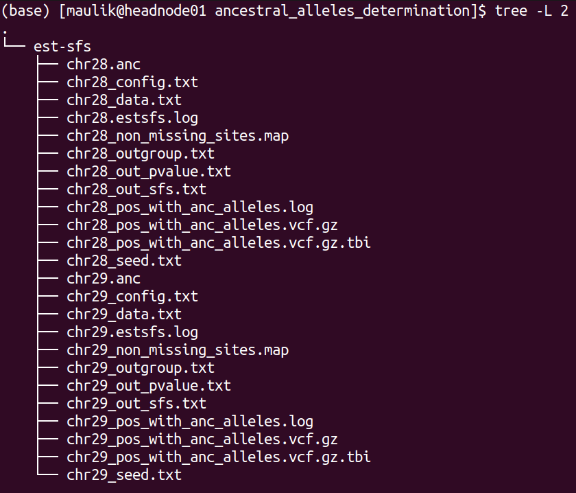

.. _selection-signature:

signatures of selection analysis
================================

This sub-workflow is intended for genome-wide detection of signatures of
selection based on phased and unphased data. It can be enabled with the
argument: ``sig_sel = true`` . It has following methods :

-  pairwise Wright’s fixation index (Fst) as implemented in VCFtools (v
   0.1.16)
-  Tajima’s D as implemented in VCFtools (v 0.1.16)
-  nucleotide diversity (pi) as implemented in VCFtools (v 0.1.16)
-  composite likelihood ratio (CLR) as implemented in SweepFinder2 (v
   1.0)
-  integrated haplotype score (iHS) as implemented in selscan (v 1.2.0a)
-  cross-population extended haplotype homozygosity (XP-EHH) as
   implemented in selscan (v 1.2.0a)

Description of the options and parameters:
==========================================

Following options require boolean parameter as an input, meaning, either
“true” or “false” (**default** is **false**).

``sig_sel`` : setting this to “false” will not run this entire workflow.

``skip_sel_outgroup``: an option to skip the outgroup when applying
signatures of selection.

``tajimas_d``: whether or not to calculate Tajima’s D.

``pi``: whether or not to calculate nucleotide diversity measure, pi.

``pairwise_fst``: whether or not to calculate pairwise Fst in windows or
for each SNP in every possible pair of populations.

``single_vs_all_fst`` : if this option is set to true, then the workflow
will take one population at a time as one member of the pair and the
remaining samples in the dataset as another member of the pair to
calculate pairwise Fst.

``skip_chrmwise``: an option relevant only for the methods implemented
in VCFtools; setting this to true will calculate Fst, Tajima’s D and pi
for each population after concatenating all chromosome-wise vcf files
into one genome-wide vcf file per population.

``clr``: whether or not to calculate CLR.

``use_precomputed_afs``: selective sweeps with pre-computed empirical
spectrum, option “-l” in SweepFinder2.

``skip_phasing``: setting this to false will skip phasing the data for
the analyses with selscan, meaning that the workflow assumed that the
supplied vcf files are already phased.

``impute_status``: an option to impute the missing genotypes (the
reference vcf file need to be provided for that), option “impute” in
Beagle.

``ihs``: whether or not to calculate iHS.

``xpehh`` : whether or not to calculate XP-EHH.

Following options require file path or string as an input (**default**
is **none**).

``skip_pop``: the path to the text file containing population IDs that
will be skipped from all the analyses implemented in this sub-workflow.

``ref_vcf``: the path to the csv file with these two columns: chromosome
ID and the path to its respective reference file in vcf format which
will be used for imputation and phasing, option “ref” in Beagle. For
reference, refer to this example file
*test_files/test_reference_imputation_panel.csv*.

``anc_files``: in case of SweepFinder2 or selscan, including the
information about ancestral and derived allele increases power of the
analyses, by invoking this option it is possible to include this
information. It takes any of these three parameters: (i) “create”:
supplying this string as parameter will invoke the process (described in
the next section) of detecting ancestral alleles using the outgroup
samples present in the vcf files; (ii). “none”: supplying this string as
parameter will perform selscan and SweepFinder2 analyses without
considering information about ancestral alleles; (iii). if none of the
“create” or “none” is supplied, then the parameter is assumed to be the
path to the csv file having these two columns: chromosome ID and the
path to its respective space separated file containing information about
ancestral alleles. For reference, refer to these example files:

``ihs_args``: `optional
parameters <https://github.com/szpiech/selscan/blob/master/manual/selscan-manual.pdf>`__
that can be applied to iHS computation.

``xpehh_args`` : `optional
parameters <https://github.com/szpiech/selscan/blob/master/manual/selscan-manual.pdf>`__
that can be applied to XP-EHH computation.

``selscan_map``: by invoking this option, it is possible to include
recombination map in SweepFinder2 analysis. It takes any of these three
parameters: (i). path to the csv file having these two columns:
chromosome ID and the path to its respective recombination map; (ii).
“default”: create map file with genetic and physical positions for each
variant site using default conversion (1 cM = 1 Mbp); (iii). “none”: the
information about recombination map will not be considered in
SweepFinder2 analyses.

``cm_map``: an option to provide a path to the csv file having these two
columns: chromosome ID and the path to its respective PLINK formated
genetic map with cM units, option “map” in Beagle.

``use_recomb_map``: selective sweeps with pre-computed empirical
spectrum and recombination map, option “-lr” in SweepFinder2. This
argument takes any of these three options: (i). if set to “default”, the
workflow will create an input file with recombination rates assuming 1cM
= 1Mbp; (ii). if set to “none”, the SweepFinder2 analysis will be run
without recombination map file; (iii), if it is neither “default” nor
“none”, the third option is path to the csv file having these two
columns: chromosome ID and the path to its respective recombination map
file in the format as recognized by SweepFinder2.

Following arguments require integer as an input.

``min_samples_per_pop``: minimum sample size of the population to be
used in the analyses. Default: 2

``tajimasd_window_size``: the desired window size for Tajima’s D
calculation. Default: 50000

``fst_window_size``: the desired window size for pairwise Fst
calculation. Default: 50000

``fst_step_size``: the desired step size between windows for Fst
calculation. Default: -9. Any value greater or equal to zero means that
window and step size are equal.

``pi_window_size``: the desired window size for pi calculation. Default:
50000.

``pi_step_size``: the desired step size between windows for pi
calculation. Default: -9. Any value greater or equal to zero means that
window and step size are equal.

``grid_space``: the spacing in number of nucleotides between grid
points, option “g” in SweepFinder2. Default: 50000

``grid_points``: the number of points equally spaced across the genome,
option “G” in SweepFinder2. Default: -9. Any value greater than zero
will carry out SweepFinder2 analyses with ``grid points`` and ignore the
value specified in ``grid space``.

``burnin_val``: the maximum number of burnin iterations, option “burnin”
in Beagle. Default: 3

``iterations_val``: the number of iterations, option “iterations” in
Beagle. Default: 12

``ne_val``: the effective population size, option “ne” in Beagle.
Default: 10000000

Overview of the processed carried out in this sub-workflow:
===========================================================

Computing iHS and XP-EHH requires phased input data while calculation of
Fst, Tajima’s D, pi and CLR don’t. Following is the brief summary of the
processes carried out by this sub-workflow:

**1.** splitting individuals’ IDs by population into each separate file
according to information provided in the sample map file and removing
the populations that don’t satisfy the threshold of minimum sample size.

**Using VCFtools to calculate Tajima’s D, Weir’s Fst and pi**

**2.** calculating Tajima’s D

**3.** calculating pi

**4.** calculating Fst for each population pair combination

**5.** calculating Fst for pair combinations of population versus all
other

**Detection of ancestral alleles
using**\ `est-sfs <https://academic.oup.com/genetics/article/209/3/897/5930981?login=false>`__

Analyses implemented in VCFtools do not require outgroup/ancestral
alleles. In case of CLR as implemented in
`SweepFinder2 <http://degiorgiogroup.fau.edu/Manual_SweepFinder2_v1.0.pdf>`__
as well as in case of iHS and XP-EHH as implemented in
`selscan <https://github.com/szpiech/selscan/blob/master/manual/selscan-manual.pdf>`__,
using the information of ancestral allele vs. derived allele increases
the power. Therefore, if the outgroup is present in the vcf files, the
following processes are carried out before applying SweepFinder2 and
selscan analyses:

**6.** if the outgroup samples are present in the vcf file, ancestral
alleles will be detected using
`est-sfs <https://academic.oup.com/genetics/article/209/3/897/5930981?login=false>`__.

   \**Note:*\* Porgram est-sfs detect ancestral alleles only for the
   sites, where all samples are genotyped and not a single sample has a
   missing genotype at this position.

**7.** create a new vcf file by extracting the sites for which the
program est-sfs has detected ancestral alleles.

**Using SweepFinder2 to calculate CLR**

**8.** preparing input files for SweepFinder2: splitting sample map (the
same as in step 1)

**9.** preparing input files for SweepFinder2: genome wide allele
frequency and recombination files with in-house Python scripts

**10.** computing the empirical frequency spectrum with SweepFinder2

**11.** calculating CLR with SweepFinder2

There are several ways of running SweepFinder2 analysis: (i). to run
without recombination map and pre-computed empirical frequency spectrum
(section 5.1 of SweepFinder2 manual), provide “none” to parameter
``use_recomb_map`` and set ``use_precompute_afs``\ to false; (ii). to
run without recombination map but with pre-computed empirical frequency
spectrum (section 5.2 of the SweepFinder2 manual), provide “none” to
parameter ``use_recomb_map``\ but set ``use_precompute_afs``\ to true;
(iii). to run with both recombination map and pre-computed empirical
frequency spectrum (section 5.3 of SweepFinder2 manual), either provide
“default” or file path to the ``use_recomb_map``\ and set
``use_precompute_afs``\ to true.

**Using selscan to calculate iHS and XP-EHH**

**12.** preparing input files for selscan: phasing genotypes with the
program Beagle

**13.** preparing input files for selscan: a map file specifying
physical distances

**14.** preparing input files for selscan: splitting the phased vcf
files by each population

**15.** calculating iHS

**16.** calculating XP-EHH for each population pair

Description of the output files and directory-structure generated by this sub-workflow:
=======================================================================================

If the pipeline has completed successfully, results of it will be stored
in **${output directory}/selection/**. Inside this directory, following
directories will be created (depending on the parameters set):

.. figure:: ../../images/selection_results_overall_dir_struct.png
   :alt: plot

   plot

The directory structure of **“input_pop”** is shown below:

.. figure:: ../../images/input_pop_dir_struct.png
   :alt: plot

   plot

Each directory contains the list of population and samples included in
the respective analysis.

The directory structure of **“vcftools”** is shown below:

.. figure:: ../../images/vcftools_dir_struct.png
   :alt: plot

   plot

There will be one directory for each analysis performed. The screenshot
above shows the directory for **“tajima_d”**, which stores the results
of calculated Tajima’s D values. Inside, there will be a directory for
each chromosome, in which are then results for each population.
Likewise, if the option ``pi`` is set to true, there will be another
directory for **“pi”** besides **“tajima_d”**.

The directory structure of **“ancestral_alleles_determination”** is
shown below:

   plot

There will be 12 files for each chromosome, of these six files are
inputs and outputs of “ests-sfs” tool:

1). \*_config.txt : the configuration file containing parameters to run
est-sfs

2). \*_data.txt : the data file

3). \*_seed.txt: the text file containing positive integer value

4). \*_out_sfs.txt: the output file containing estimated uSFS vector.

5). \*_out_pvalue.txt: the output file containing the estimated
ancestral state probabilities for each site.

6). \*_estsfs.log: the log file of est-sfs.

For detailed description of these files, refer to the manual of
`est-sfs <https://sourceforge.net/projects/est-usfs/>`__.

The description of the remaining six files are as follows:

7). \*_non_missing_sites.map: this text file contains three columns:
chromsome ID, position, and the information about the major allele. If
the major allele is based on the reference, then code in the third
column will be 0 else it will be 1 (the major allele is alternative
allele).

8). \*_outgroup.txt: information about population used as outgroup

9). \*.anc: the text file containing information about ancestral
alleles. This text file will be used in the processes of selscan and
SweepFinder2 analyses. It contains four columns: chromosome ID,
position, ancestral allele, derived allele. Number 0 refers to the
reference allele and 1 refers to the alternative allele.

10). \*_pos_with_anc_alleles.vcf.gz: This vcf file contains only those
positons where ancestral and derived alleles were determined. It will
also be used for SweepFinder2 and selscan analyses.

11). \*_pos_with_anc_alleles.vcf.gz.tbi: index file of the above file

12). \*_pos_with_anc_alleles.log: the log file containing the commands
used to generate file in steps 10 and 11.

The directory structure of **“sweepfinder2”** is shown below:

.. figure:: ../../images/sweepfinder2_results_dir_struct.png
   :alt: plot

   plot

It contains two directories: **“input_files”** and **“results”**. Inside
the **“input_files”** directory, there will be input files used to run
SweepFinder2 analysis. Inside the **“results”** directory, there will be
a directory for each chromosome. Inside this directory, there will be
results for each population.

The directory structure of **“selscan”** is shown below:

.. figure:: ../../images/selscan_o_results_dir_struct.png
   :alt: plot

   plot

There will be one directory for each performed analysis. In this
example, only iHS were computed. Inside directory **“iHS”** are two more
sub-directories: **“input_files”** and **“results”**. In the
**“input_files”** directory are input files used to run iHS analysis for
each population as well for each chromosome. Within the **“results”**
each chromosome has a separate directory, where are two files for every
population:

1). \*vcf.iHS.out: this is the raw output file generated by selscan.
This output is not normalized.

2). \*vcf_anc.iHS.out: this is the output file using the information of
ancestral allele. This output is also not normalized.

Validation of the sub-workflow:
===============================

For workflow validation, we have downloaded publicly available samples
(see map below) with whole genome sequences from NCBI database (Alberto
et al., 2018; Grossen et al., 2020; Henkel et al., 2019). We included
domestic goats (*Capra hircus*) represented by various breeds from
Switzerland. In addition to them, we also included Alpine ibex (*C.
ibex*) and Bezoar wild goat (*C. aegagrus*). Since we need an outgroup
when performing some of the analyses, we also added Urial sheep (*Ovis
vignei*). We will use variants from chromosome 28 and 29 of, all
together, 85 animals.

|plot| Geographic map of samples used for the testing and validation
purpose

| Alberto et al. (2018). Convergent genomic signatures of domestication
  in sheep and goats. \*Nature communications*,
  https://doi.org/10.1038/s41467-018-03206-y
| Grossen et al. (2020). Purging of highly deleterious mutations through
  severe bottlenecks in Alpine ibex. \*Nature communications*,
  https://doi.org/10.1038/s41467-020-14803-1
| Henkel et al. (2019). Selection signatures in goats reveal copy number
  variants underlying breed-defining coat color phenotypes. \*PLoS
  genetics*, https://doi.org/10.1371/journal.pgen.1008536

1. Required input data files
----------------------------

The input data should be in the VCF or PLINK binary format files.

All VCF files need to be splitted by the chromosomes and indexed with
tabix. Please check \*test_files/test_input_vcf.csv\* or the example
below, where, in our case, we inserted the link to the cloud stored
data. The first information in each row of input file is chromosome id,
next is path/to/the/file.vcf.gz and the last is
path/to/the/file.vcf.gz.tbi. Please note that the chromosome id must not
contain any punctuation marks.

::

   chr28,https://data.cyverse.org/dav-anon/iplant/home/maulik88/28\_filt\_samples.vcf.gz,https://data.cyverse.org/dav-anon/iplant/home/maulik88/28\_filt\_samples.vcf.gz.tbi
   chr29,https://data.cyverse.org/dav-anon/iplant/home/maulik88/29\_filt\_samples.vcf.gz,https://data.cyverse.org/dav-anon/iplant/home/maulik88/29\_filt\_samples.vcf.gz.tbi

In addition to the VCF input format, it is also necessary to prepare a
sample map file of individuals and populations. Sample map has two
tab-delimited columns: in the first column are individual IDs and in the
second are population IDs as demonstrated on the example below. It is
also important that the name of the file ends with “.map”.

::

   SRR8437780ibex AlpineIbex
   SRR8437782ibex AlpineIbex
   SRR8437783ibex AlpineIbex
   SRR8437791ibex AlpineIbex
   SRR8437793ibex AlpineIbex
   SRR8437799ibex AlpineIbex
   SRR8437809ibex AlpineIbex
   SRR8437810ibex AlpineIbex
   SRR8437811ibex AlpineIbex
   SRX5250055\_SRR8442974 Appenzell
   SRX5250057\_SRR8442972 Appenzell
   SRX5250124\_SRR8442905 Appenzell
   SRX5250148\_SRR8442881 Appenzell
   SRX5250150\_SRR8442879 Appenzell
   SRX5250151\_SRR8442878 Appenzell
   SRX5250153\_SRR8442876 Appenzell
   SRX5250155\_SRR8442874 Appenzell
   SRX5250156\_SRR8442873 Appenzell
   SRX5250157\_SRR8442872 Appenzell
   340330\_T1 Bezoar
   340331\_T1 Bezoar
   340334\_T1 Bezoar
   340340\_T1 Bezoar
   340345\_T1 Bezoar
   340347\_T1 Bezoar
   340426\_T1 Bezoar
   470100\_T1 Bezoar
   470104\_T1 Bezoar
   470106\_T1 Bezoar
   ...
   454948\_T1 Urial
   ERR454947urial Urial
   SRR12396950urial Urial

For the Plink binary input, user need to specify the path to the
BED/BIM/FAM files in the section of general parameters:
``input= "path/to/the/files/\*.{bed,bim,fam}"`` ### 2. Optional input
data files

In this sub-workflow, the user can list population IDs that should be
excluded in the analyses (``skip_pop``). For example, as we are only
interested to investigate signatures of selection in domestic goat
breeds, we excluded Alpine ibexes and Bezoar wild goats. We provided a
text file with population IDs in one column:

::

   AlpineIbex
   Bezoar

3. Setting the parameters
-------------------------

At the beginning, we have to specify some of the general parameters,
which can be found in the first tab of GUI (**general_param**):

``input``: path to the .csv input file for the VCF format or names of
the PLINK binary files;

``outDir``: the name of the output folder;

``sample_map``: path to the file with the suffix “.map” that have listed
individuals and populations as addition to VCF input;

``concate_vcf_prefix``: file prefix of the genome-wise merged vcf files;

``geo_plot_yml``: path to the yaml file containing parameters for
plotting the samples on a geographical map;

``tile_yml``: path to the yaml file containing parameters for the
geographical map to be used for plotting;

``f_chrom_len``: path to the file with chromosomes’ length for the Plink
binary inputs;

``f_pop_cord``: path to the file with geographical locations for map
plotting;

``f_pop_color``: path to the file with specified colors for map
plotting;

``fasta``: the name of the reference genome fasta file that will be used
for converting in case of PLINK input;

``allow_extra_chrom``: set to true if the input contains chromosome name
in the form of string;

``max_chrom``: maximum number of chromosomes;

``outgroup``: the population ID of the outgroup;

``cm_to_bp``: the number of base pairs that corresponds to one cM

When we have filled in all the general parameters, we can move to the
tab \**sig_sel_params**, which is intended for analysing signatures of
selection. Specify here the parameters described at the beginning of
this documentation. At the end, save the parameters as yml file.

After setting all parameters and exporting them as yml file, we are
ready to start the workflow. Choose any profile, we prefer mamba, and
set the maximum number of processes, 10 in our case, that can be
executed in parallel by each executor. From within the \**scalepopgen*\*
folder, execute the following command:

::

   nextflow run scalepopgen.nf -params-file sig\_sel.yml -profile mamba -qs 10

You can check all the other command running options with the option help
:

::

   nextflow run scalepopgen.nf -help

If the analyses processed successfully, the command line output is
looking like this:

::

   N E X T F L O W ~ version 23.04.1
   Launching `scalepopgen.nf` [astonishing\_torricelli] DSL2 - revision: b2755eec5b
   WARN: Access to undefined parameter `help` -- Initialise it to a default value eg. `params.help = some\_value`
   executor > local (44)
   [2b/18f285] process > GENERATE\_POP\_COLOR\_MAP (generating pop color map) [100%] 1 of 1, cached: 1 ✔
   [87/2886a0] process > FILTER\_SITES (filter\_sites\_CHR29) [100%] 2 of 2, cached: 2 ✔
   [48/f09ccf] process > RUN\_SEL\_VCFTOOLS:SPLIT\_MAP\_FOR\_VCFTOOLS (splitting\_idfile\_by\_pop) [100%] 1 of 1, cached: 1 ✔
   [a6/85c03d] process > RUN\_SEL\_VCFTOOLS:CONCAT\_VCF (concate\_vcf) [100%] 1 of 1, cached: 1 ✔
   [bc/c52fb5] process > RUN\_SEL\_VCFTOOLS:CALC\_TAJIMA\_D (calculating\_tajima\_d) [100%] 8 of 8, cached: 8 ✔
   [71/d9eac6] process > RUN\_SEL\_VCFTOOLS:MANHATTAN\_TAJIMAS\_D (generating\_mahnattan\_plot) [100%] 8 of 8 ✔
   [6e/53befa] process > RUN\_SEL\_VCFTOOLS:CALC\_PI (calculating\_pi) [100%] 8 of 8, cached: 8 ✔
   [26/e512bd] process > RUN\_SEL\_VCFTOOLS:MANHATTAN\_PI (generating\_mahnattan\_plot) [100%] 8 of 8 ✔
   [d4/2b7e7c] process > RUN\_SEL\_VCFTOOLS:CALC\_WFST (calculating\_pairwise\_fst) [100%] 28 of 28, cached: 26 ✔
   [8a/46f2d5] process > RUN\_SEL\_VCFTOOLS:CALC\_WFST\_ONE\_VS\_REMAINING (calculating\_one\_vs\_remaining\_fst) [100%] 8 of 8, cached: 8 ✔
   [24/aa8283] process > RUN\_SEL\_VCFTOOLS:MANHATTAN\_FST (generating\_mahnattan\_plot) [100%] 8 of 8 ✔
   [08/153d29] process > RUN\_SEL\_SWEEPFINDER2:SPLIT\_FOR\_SWEEPFINDER2 (splitting\_idfile\_by\_pop) [100%] 1 of 1, cached: 1 ✔
   [d5/ae7ef7] process > RUN\_SEL\_SWEEPFINDER2:PREPARE\_SWEEPFINDER\_INPUT (sweepfinder\_input\_CHR28) [100%] 16 of 16, cached: 16 ✔
   [a7/aae8e6] process > RUN\_SEL\_SWEEPFINDER2:COMPUTE\_EMPIRICAL\_AFS (sweepfinder\_input\_Grigia) [100%] 8 of 8, cached: 8 ✔
   [02/5b5d06] process > RUN\_SEL\_SWEEPFINDER2:RUN\_SWEEPFINDER2 (sweepfinder\_input\_Peacock) [100%] 16 of 16, cached: 16 ✔
   [dd/c91de1] process > RUN\_SIG\_SEL\_PHASED\_DATA:SPLIT\_FOR\_SELSCAN (splitting\_idfile\_by\_pop) [100%] 1 of 1, cached: 1 ✔
   [4c/b15966] process > RUN\_SIG\_SEL\_PHASED\_DATA:PHASING\_GENOTYPE\_BEAGLE (phasing\_CHR28) [100%] 2 of 2, cached: 2 ✔
   [23/35d715] process > RUN\_SIG\_SEL\_PHASED\_DATA:PREPARE\_MAP\_SELSCAN (preparing\_selscan\_map\_CHR29) [100%] 2 of 2, cached: 2 ✔
   [fa/936a01] process > RUN\_SIG\_SEL\_PHASED\_DATA:SPLIT\_VCF\_BY\_POP (split\_vcf\_by\_pop\_CHR29) [100%] 2 of 2 ✔
   [da/c5f1bf] process > RUN\_SIG\_SEL\_PHASED\_DATA:CALC\_iHS (calculating\_iHS\_CHR28) [100%] 16 of 16, cached: 16 ✔
   [cd/67a405] process > RUN\_SIG\_SEL\_PHASED\_DATA:NORM\_iHS [100%] 16 of 16, cached: 16 ✔
   [d1/198711] process > RUN\_SIG\_SEL\_PHASED\_DATA:CALC\_XPEHH (calculating\_xpehh\_CHR28) [100%] 56 of 56, cached: 56 ✔
   [01/dfc42f] process > RUN\_SIG\_SEL\_PHASED\_DATA:NORM\_XPEHH [100%] 56 of 56, cached: 56 ✔

   Completed at: 10-Sep-2023 17:36:51
   Duration : 2h 32m 41s
   CPU hours : 
   Succeeded : 

4. Description of the output:
-----------------------------

Results are stored in the specified output folder, more precisely in the
folder \**selection**. In the sub-folder
\**interactive_manhattan_plots**, we will take a look at interactive
plots of calculated Fst, pi and Tajima’s D. Plots were made separatly
for all included populations. For example, in the case of Saanen breed
from Switzerland, we detected peaks on chromosome 29 (NC_030836) that
have higher Fst values as shown in the figure below: |image1|

If we move with the pointer to one of the peaks, it will show us the
link to explore this genomic region in Ensembl.

References
==========

Please cite the following papers if you use this sub-workflow in your
study:

[1] Danecek, P., Auton, A., Abecasis, G., Albers, C. A., Banks, E.,
DePristo, M. A., Handsaker, R. E., Lunter, G., Marth, G. T., Sherry, S.
T., McVean, G., Durbin, R., & 1000 Genomes Project Analysis Group
(2011). The variant call format and VCFtools. *Bioinformatics (Oxford,
England)*, *27*\ (15), 2156–2158.
https://doi.org/10.1093/bioinformatics/btr330

[2] Keightley, P. D., & Jackson, B. C. (2018). Inferring the Probability
of the Derived vs. the Ancestral Allelic State at a Polymorphic Site.
*Genetics*, 209(3), 897–906. https://doi.org/10.1534/genetics.118.301120

[3] DeGiorgio, M., Huber, C. D., Hubisz, M. J., Hellmann, I., & Nielsen,
R. (2016). SweepFinder2: increased sensitivity, robustness and
flexibility. *Bioinformatics (Oxford, England)*, 32(12), 1895–1897.
https://doi.org/10.1093/bioinformatics/btw051

[4] Browning, B. L., Tian, X., Zhou, Y., & Browning, S. R. (2021). Fast
two-stage phasing of large-scale sequence data. *American journal of
human genetics*, 108(10), 1880–1890.
https://doi.org/10.1016/j.ajhg.2021.08

[5] Szpiech, Z. A., & Hernandez, R. D. (2014). selscan: an efficient
multithreaded program to perform EHH-based scans for positive selection.
*Molecular biology and evolution*, 31(10), 2824–2827.
https://doi.org/10.1093/molbev/msu211

[6] Di Tommaso, P., Chatzou, M., Floden, E. W., Barja, P. P., Palumbo,
E., & Notredame, C. (2017). Nextflow enables reproducible computational
workflows. *Nature biotechnology*, 35(4), 316–319.
https://doi.org/10.1038/nbt.3820

License
=======

MIT

.. |plot| image:: ../../images/Sample_info.png
.. |image1| image:: ../../images/fst.svg
