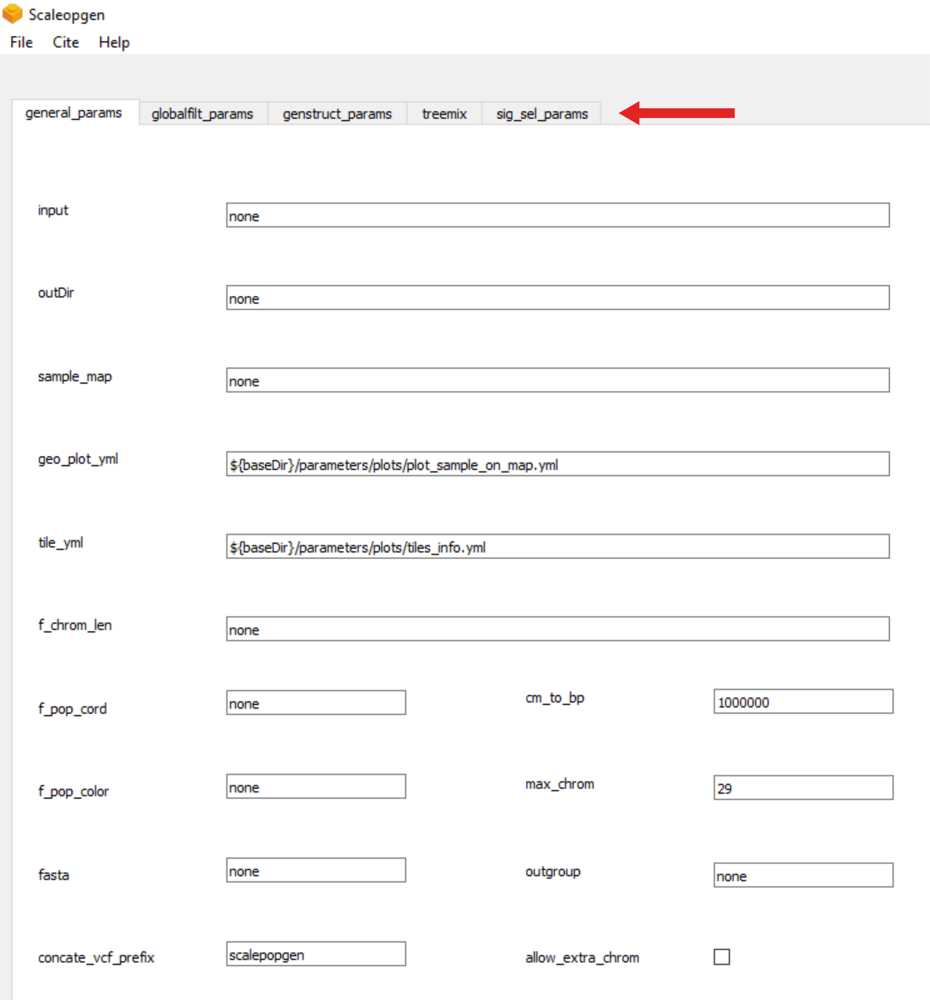
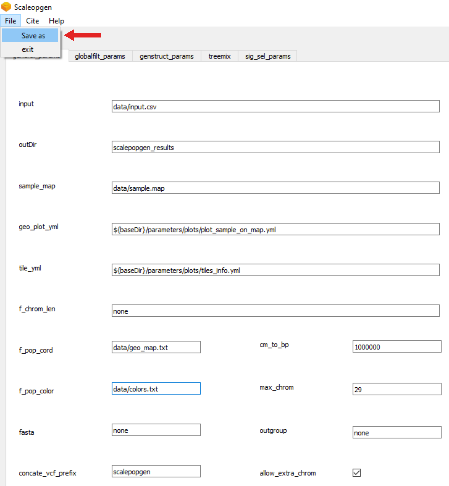

scalepopgen
===========

Pipeline to carry out comprehensive population genomic analyses.

Table of contents
-----------------

-  `About scalepopgen <#about-scalepopgen>`__
-  `Setup and test the pipeline <#setup-and-test-the-pipeline>`__
-  `Creating a yaml file of the
   parameters <#creating-a-yaml-file-of-the-parameters>`__
-  `Extra notes <#extra-notes>`__
-  `To do <#to-do>`__

About scalepopgen
~~~~~~~~~~~~~~~~~

scalepopgen is a fully automated nextflow-based pipeline that takes vcf
files or plink generated bed files as input and employ a variety of
open-source tools to carry out comprehensive population genomic
analyses. Additionally, python and R scripts have been developed to
combine and (wherever possible) plot the results of various analyses.

Broadly, the pipeline consists of the following four “sub-workflows”:

- :ref:`filtering-and-basic-statistics`. 
- :ref:`explore-genetic-structure`.
- :ref:`treemix`.
- :ref:`selection-signature`.

These four sub-workflows can be run separately or in combination with
each other.

Setup and test the pipeline
~~~~~~~~~~~~~~~~~~~~~~~~~~~

The pipeline can be run on any Linux operating system and require these
three dependencies: Java, nextflow (`Di Tommaso et al.,
2017 <https://www.nature.com/articles/nbt.3820>`__) and a software
container or environment system such as
`conda <https://docs.conda.io/projects/conda/en/latest/user-guide/install/linux.html>`__,
`mamba <https://mamba.readthedocs.io/en/latest/installation.html>`__,
`singularity <https://sylabs.io>`__, or
`docker <https://www.docker.com>`__. The pipeline can also be run on
both local linux system as well as high performance computing (HPC)
clusters. Note that all the software related dependencies of the
pipeline will be handled by nextflow after it is installed. Meaning that
the user install only the three dependencies listed above, while
nextflow automatically downloads the rest of the tools for the analyses.
scalepopgen was built and tested on nextflow version 22.10.6.5843, conda
version 23.1.0 and singularity version 3.8.6.

To test the pipeline, simply run the following command:

::

   nextflow run scalepopgen.nf -profile mamba,test_genstruct

The output folder will be created here:“…/test_genstruct_out/”. The
folder will contain interactive plots for PCA, Fst-based NJ tree,
IBS-based NJ tree. It will also contains plots for “ADMIXTURE” analyses.
These plots can be customized using the yaml file present inside the “.
/parameters/plots/”folder. Description of the inputs and outputs of the
test run can be found here.

Creating a yaml file of the parameters
~~~~~~~~~~~~~~~~~~~~~~~~~~~~~~~~~~~~~~

The workflow implement a lot of programs and tools, with the aim of
enabling users to perform a wide range of analyses. This also brings
with it a large number of parameters that need to be determined for each
sub-workflow. In order to make it more easier for user, we developed
graphical user interface (GUI). This GUI is available as an executable
within the “scp_config_generator” folder within this repo. With GUI you
can specify analyses and their options by moving through the tabs of
each workflow section marked with the arrow.

   png

Once you select and specify the parameters according to analyses you
want to perform, simply click on “File” and “Save as” yml file.

   GUI

After that run it with the command:

::

   nextflow run scalepopgen.nf -params-file analyses.yml -profile  -qs 20

A great advantage of this workflow are the interactive plots generated
using `bokeh <http://bokeh.org/>`__, which are stored in the output
folder of the respective analysis. They provide the user with a
graphical interpretation of the results, allowing to immediately get an
impression about the genomic patterns of the analyzed samples. As an
example, please take a look at `the interactive
plots <https://bioinf2305.github.io/scalepopgen_results/>`__ created
with cattle data in all the different analyzes offered by the workflow.

Extra notes
~~~~~~~~~~~

Note that read me associated with the workflow will be extensively
updated in the coming days. Before using the tiles for your publication
do not forget to include the attribution. This package comes with the
tile from Esri, therefore, these rules must be followed:
https://developers.arcgis.com/documentation/mapping-apis-and-services/deployment/basemap-attribution/.
The paper to cites have been mentioned in the respective read me
documentation.

To do
~~~~~

1). complete read me documentation
